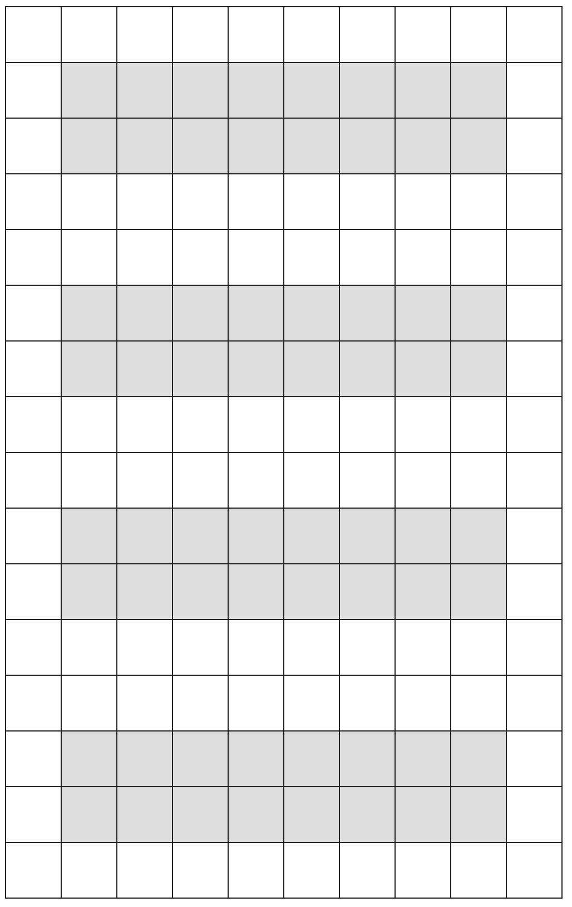

# D3-Grid-Rendering
Example of rendering grids in D3

To run locally:

* `git clone https://github.com/GTSupplyChainAR/D3-Grid-Rendering.git`
* `cd D3-Grid-Rendering`
* `open index.html`

Currently, the grid looks like this: (gray cells are those with warehouse shelves)

